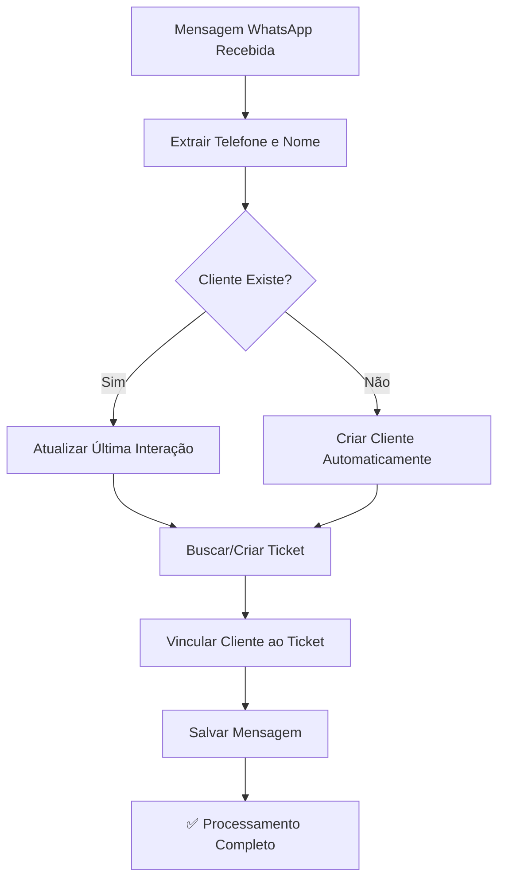

# Funcionalidade: Cadastro Automático de Clientes via Webhook

## 📋 Resumo

Implementada funcionalidade para verificar automaticamente se o número de telefone de mensagens recebidas via WhatsApp já está cadastrado como cliente. Se não estiver, o sistema faz o cadastro prévio automaticamente e vincula ao ticket.

## 🔄 Fluxo Implementado



## 🆕 Novas Funcionalidades

### 1. **Verificação de Cliente Existente**
- Busca por telefone na tabela `customers`
- Verifica apenas clientes ativos (`is_active = true`)
- Atualiza `last_interaction` quando cliente já existe
- Melhora nome do cliente se necessário (quando vem genérico)

### 2. **Cadastro Automático de Cliente**
- Cria cliente com dados extraídos do WhatsApp
- Gera email temporário único: `whatsapp-{phone}@auto-generated.com`
- Define status inicial como 'prospect'
- Categoria inicial 'bronze'
- Tags automáticas: ['auto-criado', 'whatsapp']
- Busca agente responsável padrão (admin/agent)

### 3. **Vinculação Automática**
- Vincula cliente ao ticket automaticamente
- Se ticket já existe, vincula cliente se não estiver vinculado
- Mantém informações anônimas quando cliente não pode ser criado

## 📊 Estrutura do Cliente Auto-Criado

```javascript
{
  name: "Nome do WhatsApp" || "Cliente WhatsApp 9999",
  email: "whatsapp-5511999999999@auto-generated.com",
  phone: "5511999999999",
  status: "prospect",
  category: "bronze", 
  channel: "whatsapp",
  tags: ["auto-criado", "whatsapp"],
  notes: "Cliente criado automaticamente via WhatsApp (instancia-nome)",
  responsible_agent_id: "uuid-do-agente-padrao",
  metadata: {
    auto_created: true,
    created_via: "webhook_evolution",
    instance_name: "nome-da-instancia",
    original_contact: "5511999999999",
    creation_source: "whatsapp_message"
  }
}
```

## 🔧 Funções Implementadas

### `findOrCreateCustomer({ phone, name, instanceName })`
- **Objetivo**: Verificar se cliente existe ou criar automaticamente
- **Parâmetros**: telefone, nome do WhatsApp, instância
- **Retorno**: ID do cliente (existente ou criado)
- **Tratamento de Erros**: Fallback gracioso em caso de falha

### `vinculateCustomerToTicket(ticketId, customerId)`
- **Objetivo**: Vincular cliente a ticket existente
- **Parâmetros**: ID do ticket, ID do cliente
- **Ação**: Atualiza `customer_id` no ticket

### Melhorias em `createTicketAutomaticamente()`
- **Nova funcionalidade**: Aceita `customerId` para vinculação automática
- **Metadata**: Informações do cliente e contexto da criação
- **Compatibilidade**: Mantém fallback para clientes anônimos

### Melhorias em `findExistingTicket()`
- **Busca Expandida**: Verifica `whatsapp_phone` e `client_phone`
- **Status Múltiplos**: Busca tickets em ['open', 'pendente', 'atendimento']
- **Ordenação**: Prioriza tickets mais recentes

## 📝 Logs e Monitoramento

### Logs de Verificação
```
🔍 Verificando se cliente existe: { phone: "5511999999999", name: "João Silva" }
✅ Cliente já cadastrado: { id: "uuid", name: "João Silva", phone: "5511999999999" }
```

### Logs de Criação
```
🆕 Cliente não encontrado, criando automaticamente...
✅ Novo cliente criado automaticamente: { id: "uuid", name: "João Silva", phone: "5511999999999", email: "whatsapp-5511999999999@auto-generated.com" }
```

### Logs de Vinculação
```
🔗 Vinculando cliente ao ticket: { ticketId: "ticket-uuid", customerId: "client-uuid" }
✅ Cliente vinculado ao ticket com sucesso
```

## ⚠️ Tratamento de Erros

### Email Duplicado
- **Problema**: Email temporário já existe
- **Solução**: Adiciona timestamp ao email: `whatsapp-{phone}-{timestamp}@auto-generated.com`

### Falha na Criação
- **Comportamento**: Sistema continua com cliente anônimo
- **Log**: `⚠️ Erro ao verificar/criar cliente, continuando com cliente anônimo`

### Falha na Vinculação
- **Comportamento**: Ticket é criado mas sem vinculação
- **Log**: `❌ Erro ao vincular cliente ao ticket`

## 🎯 Benefícios

1. **Automatização Completa**: Reduz trabalho manual dos agentes
2. **Base de Clientes Atualizada**: Cadastro automático de novos contatos
3. **Rastreamento Melhorado**: Histórico completo de interações
4. **Fallback Gracioso**: Sistema continua funcionando mesmo com falhas
5. **Metadados Ricos**: Informações de contexto para análise

## 🔄 Compatibilidade

- ✅ **Frontend**: Sistema existente reconhece clientes vinculados
- ✅ **Backend**: Webhooks existentes continuam funcionando
- ✅ **Banco**: Tabela `customers` já existente é utilizada
- ✅ **Interface**: Modal de atribuição de clientes mostra dados atualizados

## 🚀 Status

**✅ IMPLEMENTADO E FUNCIONAL**

- Webhook processa mensagens automaticamente
- Clientes são criados/vinculados em tempo real
- Logs detalhados para monitoramento
- Tratamento robusto de erros
- Sistema totalmente retrocompatível 