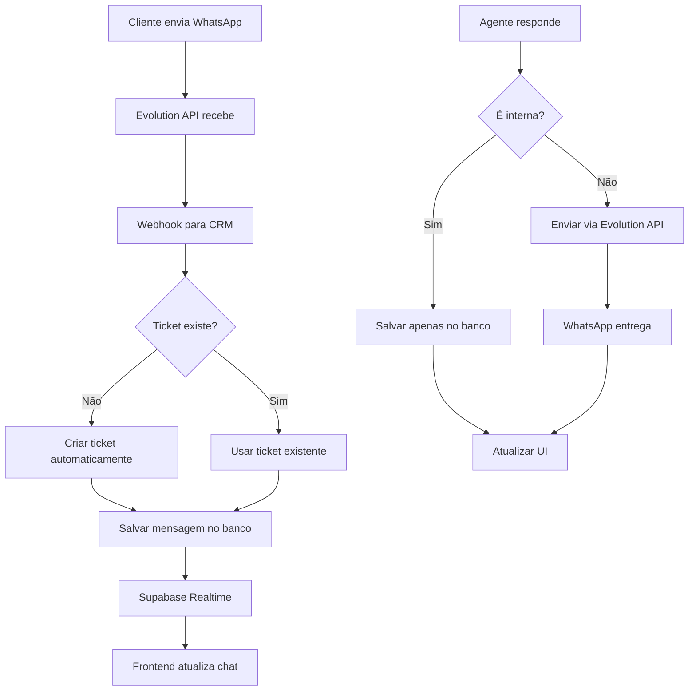

# 📱 Integração Evolution API - WhatsApp Business

Esta documentação detalha como configurar e usar a integração completa da Evolution API com o CRM para envio e recebimento de mensagens WhatsApp.

## 🎯 Visão Geral

A integração permite:
- ✅ **Criar e gerenciar instâncias** do WhatsApp via Evolution API
- ✅ **Conectar números** através de QR Code
- ✅ **Enviar mensagens** diretamente do TicketChat
- ✅ **Receber mensagens** em tempo real via webhooks
- ✅ **Criação automática de tickets** para novas conversas
- ✅ **Status de conexão** em tempo real
- ✅ **Formatação automática** de números brasileiros

## 🛠️ Configuração Inicial

### 1. Evolution API
Certifique-se de que você tem uma instância da Evolution API rodando. Configure as variáveis de ambiente:

```env
# .env.local
VITE_EVOLUTION_API_URL=http://localhost:8080
VITE_EVOLUTION_API_KEY=sua-chave-api-global
```

### 2. Webhook Endpoint
Configure um endpoint para receber webhooks da Evolution API:

```typescript
// /api/webhooks/evolution
import { EvolutionWebhookProcessor } from '@/services/evolution-webhook-processor';

export async function POST(request: Request) {
  try {
    const payload = await request.json();
    
    // Processar webhook
    await EvolutionWebhookProcessor.processWebhook(payload);
    
    return new Response('OK', { status: 200 });
  } catch (error) {
    console.error('Erro no webhook:', error);
    return new Response('Error', { status: 500 });
  }
}
```

### 3. Configurar Webhook Global na Evolution API
Configure a URL do webhook nas variáveis de ambiente da Evolution API:

```env
# Evolution API .env
WEBHOOK_URL_GLOBAL=https://seu-dominio.com/api/webhooks/evolution
WEBHOOK_BY_EVENTS=true
```

## 🚀 Como Usar

### 1. Criando uma Instância WhatsApp

1. **Acesse o Gerenciador de Instâncias:**
   - Vá para a seção de administração
   - Abra "Instâncias WhatsApp"

2. **Criar Nova Instância:**
   ```typescript
   // Exemplo de criação via código
   const instanceName = "vendas-principal";
   const response = await evolutionApiService.createInstance(instanceName);
   ```

3. **Conectar via QR Code:**
   - Clique em "Conectar" na instância criada
   - Escaneie o QR Code com o WhatsApp
   - Aguarde a confirmação de conexão

### 2. Configurando Ticket para WhatsApp

Para que um ticket use WhatsApp, ele precisa ter os metadados:

```typescript
const ticketMetadata = {
  evolution_instance_name: "vendas-principal",
  client_phone: "5511999998888", // Formato internacional
  client_name: "João Silva"
};
```

### 3. Enviando Mensagens

No TicketChat, quando você envia uma mensagem:

1. **Mensagem Interna:** Salva apenas no banco de dados
2. **Mensagem Externa + WhatsApp Conectado:** Envia via WhatsApp e salva no banco
3. **Mensagem Externa + WhatsApp Desconectado:** Salva apenas no banco com aviso

```typescript
// O sistema verifica automaticamente:
if (!isInternal && whatsappInstance && whatsappStatus === 'connected') {
  // Envia via WhatsApp
  await evolutionApiService.sendTextMessage(whatsappInstance, {
    number: clientPhone,
    textMessage: { text: message }
  });
}
```

### 4. Recebendo Mensagens

As mensagens chegam automaticamente via webhook:

1. **Webhook recebe evento `MESSAGES_UPSERT`**
2. **Sistema verifica se é mensagem de cliente**
3. **Busca ticket existente ou cria automaticamente**
4. **Salva mensagem no banco**
5. **Frontend recebe via Supabase Realtime**

## 📋 Estrutura de Dados

### Ticket com WhatsApp
```typescript
interface TicketWithWhatsApp {
  id: string;
  title: string;
  subject: string;
  metadata: {
    evolution_instance_name: string;  // Nome da instância
    client_phone: string;            // Telefone no formato internacional
    client_name: string;             // Nome do cliente
    auto_created?: boolean;          // Se foi criado automaticamente
    created_from_whatsapp?: boolean; // Se veio do WhatsApp
  };
}
```

### Mensagem com Metadados WhatsApp
```typescript
interface MessageWithWhatsApp {
  id: string;
  ticket_id: string;
  content: string;
  sender_name: string;
  type: 'text' | 'image' | 'video' | 'audio' | 'document';
  metadata: {
    whatsapp_instance?: string;      // Instância usada
    sent_via_whatsapp?: boolean;     // Se foi enviada via WhatsApp
    is_from_whatsapp?: boolean;      // Se veio do WhatsApp
    evolution_message_id?: string;   // ID da mensagem na Evolution
    sender_phone?: string;           // Telefone do remetente
    media_url?: string;              // URL da mídia (se houver)
  };
}
```

## 🔧 Funções Principais

### evolutionApiService

```typescript
// Instâncias
await evolutionApiService.createInstance('nome-instancia');
await evolutionApiService.getInstanceQRCode('nome-instancia');
await evolutionApiService.getInstanceStatus('nome-instancia');
await evolutionApiService.deleteInstance('nome-instancia');

// Mensagens
await evolutionApiService.sendTextMessage('instancia', {
  number: '5511999998888',
  textMessage: { text: 'Olá!' }
});

await evolutionApiService.sendMediaMessage('instancia', {
  number: '5511999998888',
  mediaMessage: {
    mediatype: 'image',
    media: 'base64-ou-url',
    caption: 'Legenda da imagem'
  }
});

// Utils
const formatted = evolutionApiService.formatPhoneNumber('11999998888');
const isValid = evolutionApiService.isValidWhatsAppNumber('5511999998888');
```

### EvolutionWebhookProcessor

```typescript
// Processamento automático de webhooks
await EvolutionWebhookProcessor.processWebhook(webhookPayload);

// Eventos suportados:
- MESSAGES_UPSERT    // Nova mensagem recebida
- CONNECTION_UPDATE  // Status de conexão alterado
- QRCODE_UPDATED    // QR Code atualizado
- SEND_MESSAGE      // Confirmação de envio
```

## 📱 Interface do Usuário

### TicketChat - Recursos WhatsApp

1. **Status de Conexão:**
   - Badge verde: Conectado
   - Badge vermelho: Desconectado
   - Informações da instância

2. **Botão de Envio Inteligente:**
   - Verde + ícone smartphone: Enviará via WhatsApp
   - Azul + ícone enviar: Apenas interno/email

3. **Indicadores de Mensagem:**
   - Mensagens vindas do WhatsApp têm metadados específicos
   - Histórico completo de conversas

### Gerenciador de Instâncias

1. **Lista de Instâncias:**
   - Status em tempo real
   - Departamento associado
   - Último update

2. **Ações Disponíveis:**
   - Conectar/Desconectar
   - Gerar QR Code
   - Verificar status
   - Deletar instância

## 🚨 Tratamento de Erros

### Cenários Comuns

1. **WhatsApp Desconectado:**
   ```typescript
   // Sistema salva mensagem mas exibe aviso
   toast({
     title: "📱 WhatsApp desconectado",
     description: "Mensagem salva apenas no sistema",
     variant: "destructive"
   });
   ```

2. **Telefone Inválido:**
   ```typescript
   // Validação automática
   if (!evolutionApiService.isValidWhatsAppNumber(phone)) {
     // Exibe erro e não envia
   }
   ```

3. **Instância Não Configurada:**
   ```typescript
   // Verifica se ticket tem instância
   if (!currentTicket.metadata?.evolution_instance_name) {
     // Envia apenas internamente
   }
   ```

## 🔍 Debug e Logs

### Logs Importantes

```typescript
// Criação de instância
console.log('✅ Instância criada:', response.data);

// Envio de mensagem
console.log('📤 Enviando via WhatsApp [Instância: vendas]');
console.log('✅ Mensagem enviada para 5511999998888');

// Recebimento de webhook
console.log('📨 Processando webhook:', payload.event);
console.log('📩 Nova mensagem recebida:', instanceName);

// Auto-criação de ticket
console.log('🆕 Criando ticket automaticamente...');
console.log('✅ Ticket criado automaticamente:', ticketId);
```

### Comandos de Teste

```typescript
// No console do navegador
window.evolutionTest = {
  createInstance: (name) => evolutionApiService.createInstance(name),
  sendMessage: (instance, phone, text) => 
    evolutionApiService.sendTextMessage(instance, {
      number: phone,
      textMessage: { text }
    }),
  checkStatus: (instance) => evolutionApiService.getInstanceStatus(instance)
};

// Teste rápido
await window.evolutionTest.createInstance('teste');
await window.evolutionTest.sendMessage('teste', '5511999998888', 'Olá!');
```

## 📊 Monitoramento

### Métricas Importantes

1. **Status das Instâncias:** Quantas conectadas/desconectadas
2. **Taxa de Entrega:** Mensagens enviadas vs. confirmadas
3. **Tickets Auto-criados:** Quantos tickets vieram do WhatsApp
4. **Tempo de Resposta:** Latência entre webhook e processamento

### Logs de Auditoria

- Criação/exclusão de instâncias
- Conexões/desconexões
- Mensagens enviadas/recebidas
- Erros de integração

## 🔒 Segurança

### Validações Implementadas

1. **API Key:** Verificação em todas as chamadas
2. **Webhook Signature:** Validação de origem (recomendado)
3. **Rate Limiting:** Controle de frequência
4. **Phone Validation:** Formato brasileiro obrigatório

### Boas Práticas

1. **Não expor API keys** no frontend
2. **Usar HTTPS** para webhooks
3. **Validar payloads** de webhook
4. **Log de auditoria** completo
5. **Backup de instâncias** importantes

## 🔄 Fluxo Completo



## 📝 Próximos Passos

1. **Mídia:** Implementar envio de imagens/documentos
2. **Templates:** Sistema de templates de mensagem
3. **Agendamento:** Mensagens agendadas
4. **Analytics:** Dashboard de métricas WhatsApp
5. **Multi-instância:** Suporte a múltiplas instâncias por departamento

---

## 🆘 Suporte

Para problemas com a integração:

1. **Verifique os logs** do browser (F12)
2. **Teste a Evolution API** diretamente
3. **Valide o webhook** endpoint
4. **Confirme as variáveis** de ambiente
5. **Verifique a conexão** da instância

**Logs importantes estão marcados com emojis:**
- ✅ Sucesso
- ❌ Erro
- ⚠️ Aviso
- 📱 WhatsApp
- 📨 Webhook
- 🆕 Auto-criação 